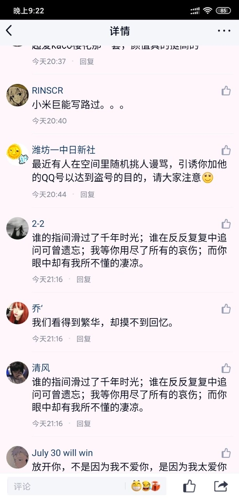

# 2020-05-13 “速生杨、韭菜、野草，水军？”事件

### 事件概要
这里引用来自一位活跃社员的记述稿：  
> 各位亲爱的同学，朋友们：  
> 好消息！好消息！就在今晚！小新的前一条中性笔测评说说的评论区炸了！  
>  其中，有同学对饼馕栏目的质量提出了充分肯定；  
> 有同学对视频内容的实用发出了赞叹；  
> 在这些同学们的支持下，我们已经万分感动。  
> 可今晚，最让我们感动的，是一群不知道从哪里来的人工智障不远万里顺着网线爬来对我们的视频表示了肯定——  
> 一位愿意透露姓名的朋友率先攻入，对没加小新好友表达了出离的愤怒与吃醋；  
>  紧接其后，一队闪烁着非主流风采的水军，他们进来了！  
> 他们先是用鸡汤滋润了小新评论区的每一片土地，调动起地下两米八的氮磷钾；  
> 接着，他们又用大水漫灌的方式对我们一丝不苟的视频质量表达了自己的肯定——他们，竟然说我们拿了商家的钱！这句话真挚的肯定了小新的视频质量和广阔的发展前景！  
>  看到这几十句一个模子里出来的、让流水线自愧不如的话，小新背后的运营人员又是感激又是欣慰，在表达我们的欢庆和删掉那些极其真挚的捧臭脚评论之余，决定发出这片公告：  
> 从今天起，5月13日，将成为小新隆重的纪念日！  
> 在这一天，饼和馕先是在鸡汤里泡软，接着又在大水里溶解；  
> 视频作者饼同学被一群非主流评论浸泡，她有了她的大名——“飞（非）饼”；  
> 而她亲密的战友，馕同学也为自己起了一个贴合饼同学大名的大名——“杠子头”！  
>  在这一天，我们第一次有了竞争对手（虽然不知道他是谁），第一次见到了针对我们的水军！  
> 我们，感谢你们！你们让我们的今晚不再只有作业，更有了一片欢声笑语和一群笑到找不到头的朋友！  
> 你们的出现，是我们一次里程碑式的胜利！  
>  此致敬礼！  
> 我是感动万分的杠子头——馕同学~  
> （另：感谢各位水军的肯定，不过我们还没有火到有商家可以让我们恰钱的程度。即使如果我们要恰钱也一定会给大家标注上的）  

### 纪实档案
评论区精彩片段：  
  
  
  
工作群内沙雕实况：  
  
  
  
  
  
  
  
  
  
  
  
